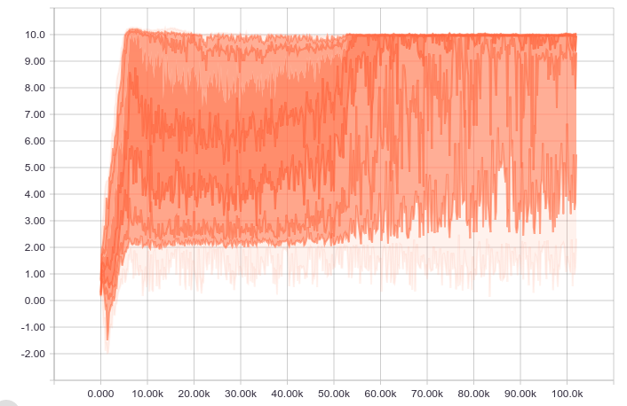
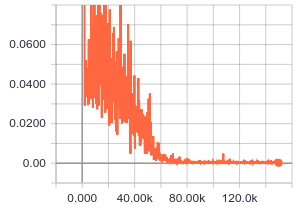

# advanced_policy_gradient_methods

## How this code is different from the openai baselines

- Many features used in the implementation has been included in [TensorFlow](https://github.com/tensorflow/tensorflow), though, the openai baselines choose to re-implement them in [their common libraries](https://github.com/openai/baselines/tree/master/baselines/common) (Possibly due to the high stability requirement). The following are a few examples:
  - `tf.distributions.Distribution`： When reparameterization-trick is used to randomize a network.
  - `tf.orthogonal_initializer`: Different from computer vision tasks, in most cases, the reinforcement learning deep learning models use orthogonal initialization instead of Xavier initialization. A minor difference is that, the orthogonalization in TensorFlow is implemented using QR decomposition, while OpenAI uses SVD.
- The conjugate gradient optimization in this repo is implemented inside the TensorFlow computation graph, which will accelarate the training (and probably slow for big nets when compiling). In the baseline, this part is implemented with numpy.
- For the purpose of study, much more statistics are included in this repo. The visualization can be achieved with tensorboard, csv files, or video records.

## Some of the results

### DDPG

<figure>
    
    <figcaption align="center">Q-function distribution</figcaption>
</figure>

<figure>
    
    <figcaption align="center">Average rewards</figcaption>
</figure>

<figure>
    
    <figcaption align="center">Critic loss</figcaption>
</figure>

### MADDPG

**Updated in March 24th, 2019:**  Re-implement asynchronous version of MADDPG using the [OpenAI multi-agent particle environments](https://github.com/openai/multiagent-particle-envs)

<figure>
    
    <figcaption align="center">Exponential Moving Average Rewards</figcaption>
</figure>